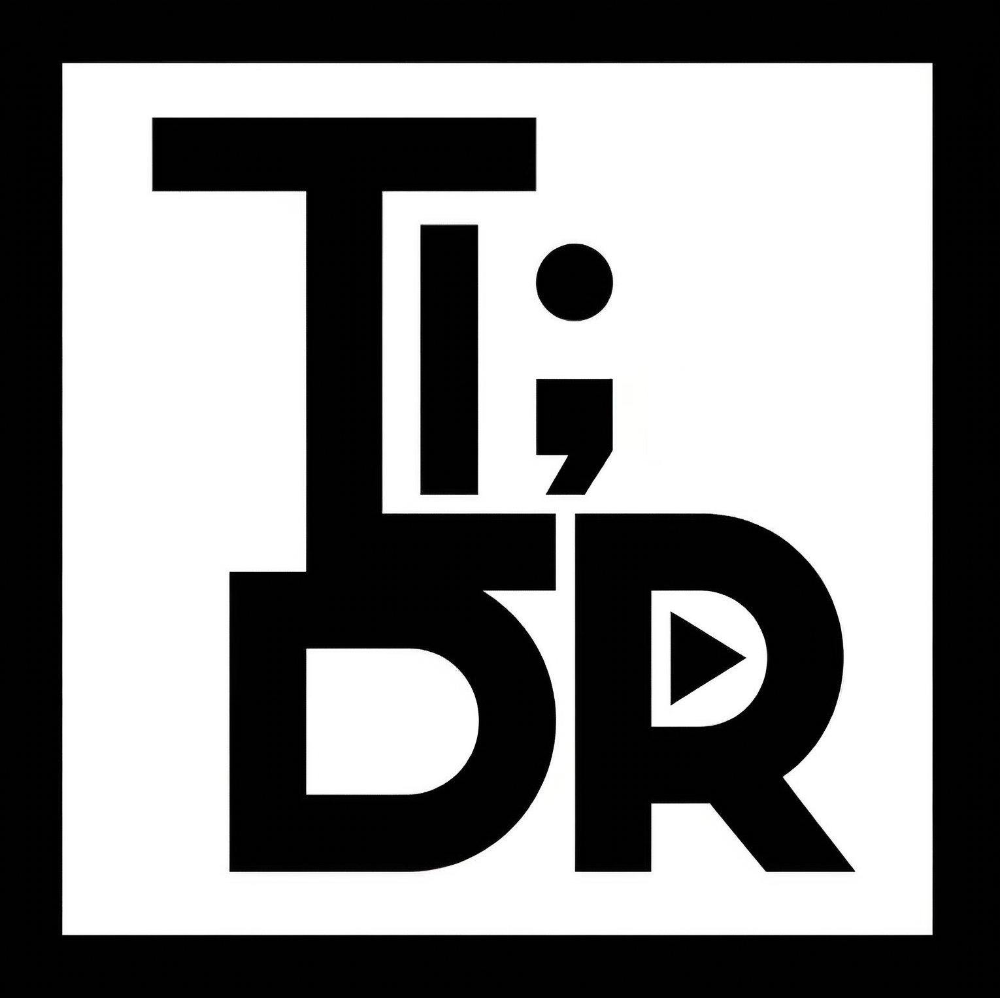
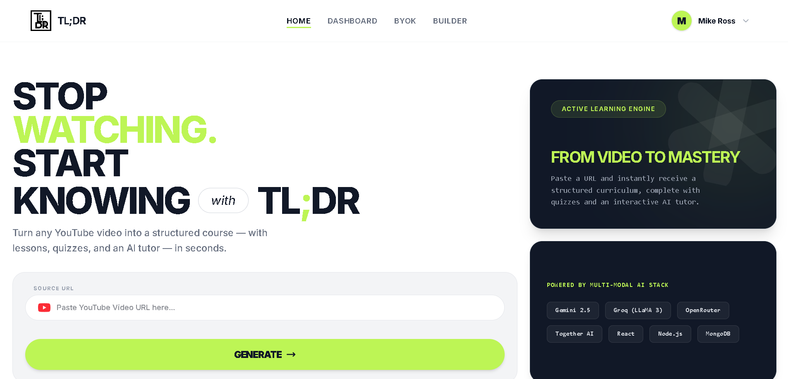

<p align="center">
  
</p>

<h1 align="center">DotLDR</h1>

<p align="center">
TL;DR — Smart course generation and video summarization powered by Gemini AI.
</p>

<p align="center">
  
  &nbsp;&nbsp;&nbsp;&nbsp;
  
  &nbsp;&nbsp;&nbsp;&nbsp;
  
  &nbsp;&nbsp;&nbsp;&nbsp;
  
  &nbsp;&nbsp;&nbsp;&nbsp;
  
  &nbsp;&nbsp;&nbsp;&nbsp;

</p>

<br />
<br />

<h1 align="center">
STOP<br />
WATCHING.<br />
START<br />
KNOWING
</h1>

<p align="center">
with
</p>

<h2 align="center">
TL;DR
</h2>

<br />
<br />

## Demo

<p align="center">
  <a href="TLDR_Demo.mp4">
    
  </a>
</p>

<br />

## Architecture

```text
       YouTube URL
            │
            ▼
    [ Transcripting ] ───▶ youtube-transcript
            │
            ▼
    [   Chunking    ] ───▶ Token-aware (Gemini-optimized)
            │
            ▼
    [      RAG      ] ───▶ Semantic search (In-memory)
            │
            ▼
       [ AI Tutor ] ───▶ Gemini 2.0 Flash
```

### The Pipeline
1. **Transcripting**: We extract raw text and timing data from YouTube videos using high-reliability transcript fetching.
2. **Chunking**: Large transcripts are split into semantically dense chunks. Our token-aware chunker targets ~1,000 tokens per segment to maximize context for Gemini while staying within efficiency limits.
3. **RAG (Retrieval-Augmented Generation)**: For the interactive chat tutor, we use a custom RAG pipeline. It performs semantic search over lesson chunks using vector embeddings to retrieve the most relevant context for every student question.

### Core Services
- **Models**: Powered by **Gemini 2.0 Flash** and **2.5 Flash** for lightning-fast reasoning and course generation.
- **OTP Gateway**: Secure authentication via a **Cloudflare Worker** gateway integrated with the **Resend API** for high-deliverability email verification.
- **Database**: **MongoDB** serves as our primary persistence layer for course structures, progress tracking, and chat histories.

<br />
<br />

<p align="center">
  Built with intention.
</p>
